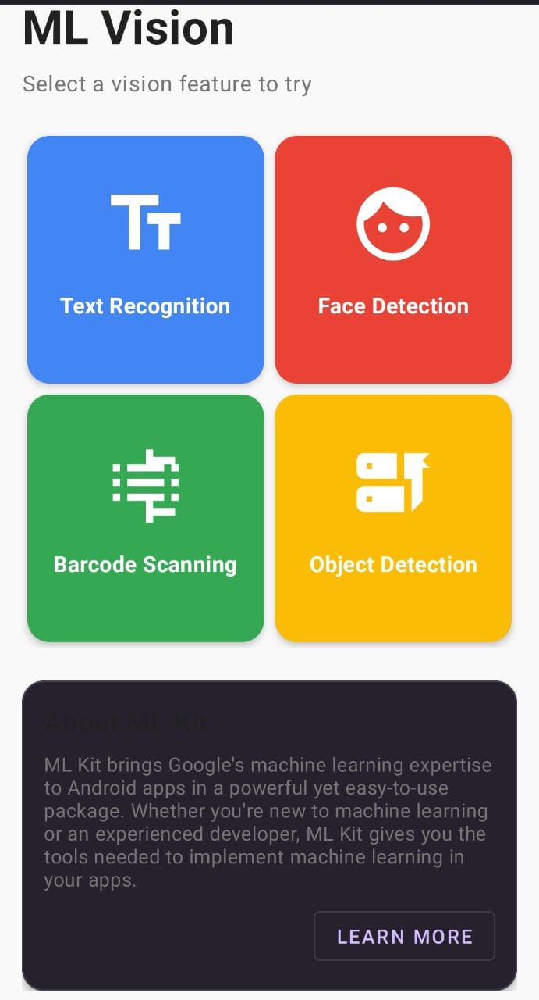
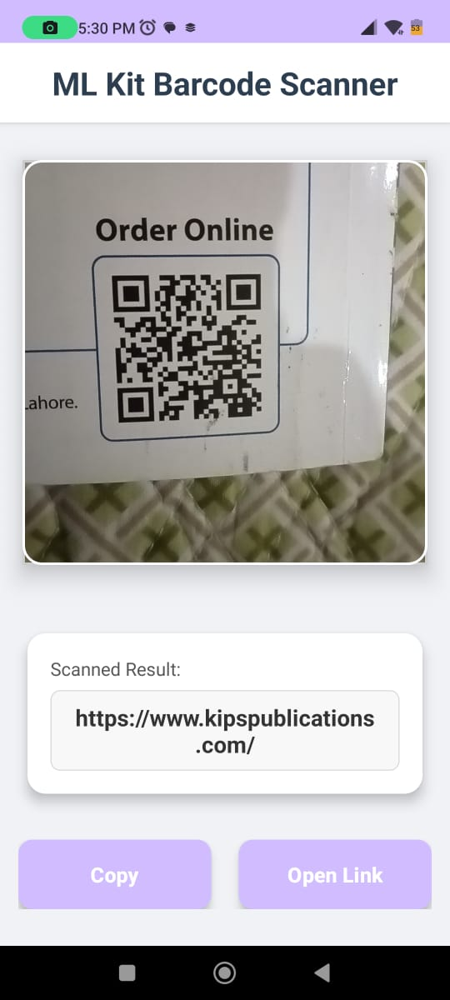
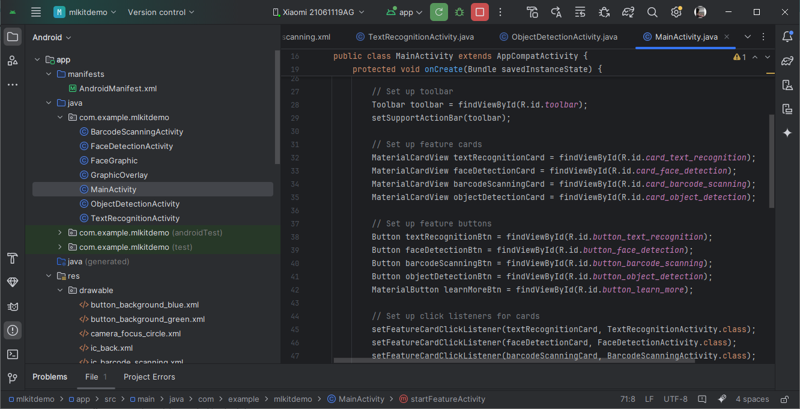
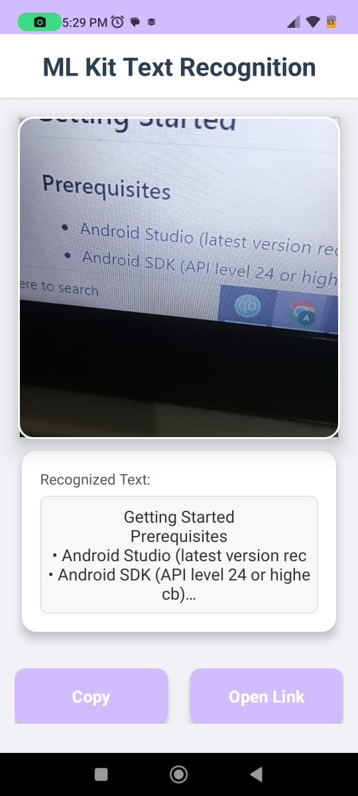

# ML Kit Android Application

This project is a comprehensive Android application built to showcase the powerful capabilities of Firebase ML Kit for various on-device machine learning tasks. It integrates multiple ML Kit APIs to provide real-time and interactive functionalities directly from your device's camera.

## Overview
Using **java** and **groovy**
This application features four distinct modules, each demonstrating a core ML Kit capability:

- **Barcode Scanning**: Real-time detection and decoding of various barcode formats.
- **Text Recognition**: Live extraction of text from images captured by the camera.
- **Face Detection**: Real-time detection of faces with bounding box overlays.
- **Object Detection**: Live detection and classification of common objects in the camera feed.

## Features

### General Features:
- Modern and intuitive Material Design UI/UX.
- Uses CameraX for efficient camera integration.
- Dynamic handling of camera permissions.

### Barcode Scanning:
- Real-time barcode and QR code detection.
- Copy scanned barcode data to clipboard.
- Search scanned barcode content directly on Google.
- Vibration and sound feedback on successful scan.

### Text Recognition:
- Real-time text extraction from the camera stream.
- Ability to "freeze" the current recognized text for closer inspection.
- Copy recognized text to clipboard.
- Search recognized text directly on Google.
- Flashlight toggle for low-light conditions.

### Face Detection:
- Real-time detection of multiple faces.
- Draws bounding boxes around detected faces.
- (Future enhancements could include face landmarks, contours, or classification.)

### Object Detection:
- Real-time detection and classification of objects in the camera feed.
- Draws bounding boxes and labels for detected objects.
- (Future enhancements could include tracking or custom models.)

## Screenshots / Demo






## Getting Started

### Prerequisites

- Android Studio (latest version recommended)
- Android SDK (API level 24 or higher)
- A physical Android device with a camera (for best real-time performance) or an emulator.

### Cloning the Repository

```bash
git clone https://github.com/AliMusaRizvi/ML-Kit-App.git
cd ML-Kit-App
```

### Opening in Android Studio

1. Open Android Studio.
2. Select **File > Open** or **Open an existing Android Studio project**.
3. Navigate to the cloned `ML-Kit-App` directory and click **OK**.
4. Let Gradle sync the project.

### Running the Application

1. Connect an Android device to your computer or launch an emulator.
2. Ensure USB debugging is enabled on your device.
3. Click the **Run** button (green play icon) in Android Studio.

## Permissions

The application requires the following permissions, which will be requested at runtime:

- `android.permission.CAMERA`: To access the device's camera for real-time analysis.
- `android.permission.VIBRATE`: For haptic feedback on barcode scans.

## Dependencies

Key dependencies used in this project (defined in `app/build.gradle` and `gradle/libs.versions.toml`):

- **CameraX**: For camera integration (`androidx.camera:camera-core`, `camera-camera2`, `camera-lifecycle`, `camera-view`).
- **ML Kit Barcode Scanning**: `com.google.mlkit:barcode-scanning`
- **ML Kit Text Recognition**: `com.google.mlkit:text-recognition` (and language-specific models like `-chinese`, `-korean` if used)
- **ML Kit Face Detection**: `com.google.mlkit:face-detection`
- **ML Kit Object Detection**: `com.google.mlkit:object-detection`
- **Material Design**: `com.google.android.material:material`
- **AndroidX Libraries**: `androidx.core`, `androidx.appcompat`, `androidx.constraintlayout`, `androidx.cardview`, etc.
- **Guava**: For ListenableFuture support.

## Usage

### Barcode Scanner:
1. Launch the Barcode Scanner activity.
2. Point your camera at a barcode or QR code.
3. The recognized data will appear at the bottom.
4. Use the "Copy" button to copy the text.
5. Use the "Search Google" button to search for the data online.

### Text Recognition:
1. Launch the Text Recognition activity.
2. Point your camera at any text (e.g., a book, a sign).
3. The recognized text will appear in real-time.
4. Tap the camera icon (capture button) to "freeze" the current text.
5. Use the "Copy" button to copy the frozen text.
6. Use the "Search Google" button to search for the text online.
7. Tap the flash icon to toggle the camera's flashlight.

### Face Detection:
1. Launch the Face Detection activity.
2. Point your camera at faces.
3. Green bounding boxes will appear around detected faces.

### Object Detection:
1. Launch the Object Detection activity.
2. Point your camera at various objects.
3. Bounding boxes with labels will appear for recognized objects.

## Contributing

Contributions are welcome! If you find a bug or have an improvement, please open an issue or submit a pull request.

## License

This project is licensed under the MIT License - see the LICENSE file for details.